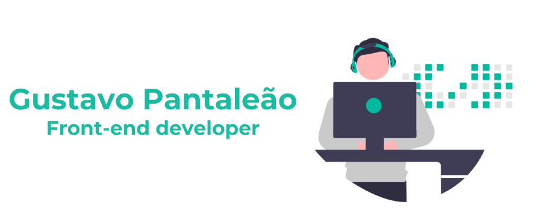

  

## Hi I'm Gustavo, Nice to meet you

Passionate front-end developer dedicated to expanding skills in web development, committed to delivering exceptional results and staying at the forefront of the industry. 🚀👨‍💻

  

  

  
  
  
  
  
  
  
  
  
  
  
  
  
  
  
  
  

 

 

  

  
  
  
  
  
  
  

 

 

  

If you want to talk to me, don't be shy, send me a message or just say "hi" 😄

 

 

  

 

  
  
 

 

  

